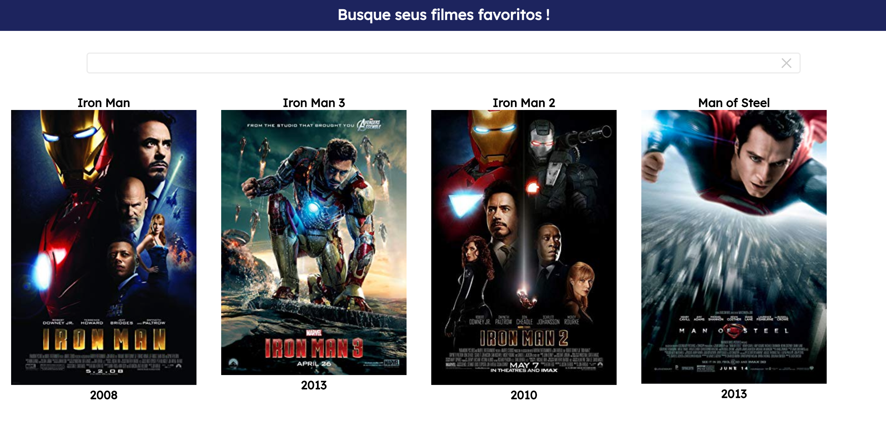

# Search Movies, a Vue.js project



Projeto criado utilizando vue.js, e feito para fazer buscas de filmes e séries em geral, a busca é feita pelo IMDB, os resultados trazidos são nome ,um poster se existir e sua data de lançamento, no caso das séries trará a data de lançamento da temporada, veja se seu filme e ou série favorito aparece :)

## Visite o projeto !
O projeto se encontra aqui: [Search movies](http://search-my-movies.surge.sh).

## Como rodar o projeto

```bash
git clone https://github.com/teckthor/search-movies.git
yarn install or npm install
```

### Compilar para desenvolvimento
```bash
yarn serve
```

Licence MIT
